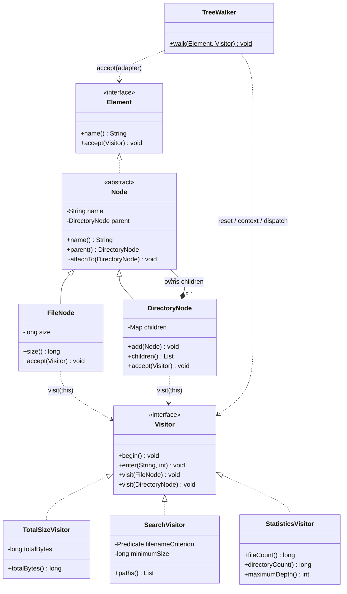

# Class diagram

```mermaid
classDiagram
direction TB
class Element {
  <<interface>>
  +name() String
  +accept(Visitor) void
}
class Node {
  <<abstract>>
  -String name
  -DirectoryNode parent
  +name() String
  +parent() DirectoryNode
  ~attachTo(DirectoryNode) void
}
class FileNode {
  -long size
  +size() long
  +accept(Visitor) void
}
class DirectoryNode {
  -Map children
  +add(Node) void
  +children() List
  +accept(Visitor) void
}
class Visitor {
  <<interface>>
  +begin() void
  +enter(String, int) void
  +visit(FileNode) void
  +visit(DirectoryNode) void
}
class TotalSizeVisitor {
  -long totalBytes
  +totalBytes() long
}
class SearchVisitor {
  -Predicate filenameCriterion
  -long minimumSize
  +paths() List
}
class StatisticsVisitor {
  +fileCount() long
  +directoryCount() long
  +maximumDepth() int
}
class TreeWalker {
  +walk(Element, Visitor)$ void
}
Element <|.. Node
Node <|-- FileNode
Node <|-- DirectoryNode
DirectoryNode "0..1" *-- "0..*" Node : owns children
Visitor <|.. TotalSizeVisitor
Visitor <|.. SearchVisitor
Visitor <|.. StatisticsVisitor
FileNode ..> Visitor : visit(this)
DirectoryNode ..> Visitor : visit(this)
TreeWalker ..> Element : accept(adapter)
TreeWalker ..> Visitor : reset / context / dispatch
```
